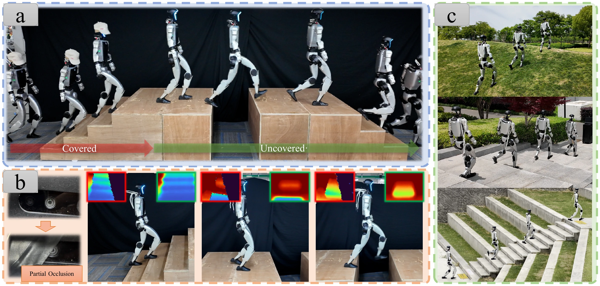

<h1 align="center">CAP</h1>
<h3 align="center">Continuously Adaptive Perception-Blind Humanoid Locomotion<br>via Learned Denoising</h3>

<p align="center">
  <a href="https://hoshi-no-ai.github.io/CAP/"></a>
  <a href="https://arxiv.org/abs/2609.11553"></a>
  <a href="https://youtu.be/GE_GassSkYM"></a>
  
</p>

<p align="center">Hongjin Chen<sup>1,2</sup> · Zijun Xu<sup>1,3</sup> · Shihao Ma<sup>1</sup> · Yi Zhao<sup>1</sup> · Xilai Liu<sup>4</sup> · Ke Ma<sup>1,2</sup> · Wei Zhang<sup>4</sup> · Chunyang Xie<sup>4</sup> · Pengfei Li<sup>2</sup> · Jieru Zhao<sup>5</sup> · Wenchao Ding<sup>1,2,*</sup></p>

<p align="center"><sup>1</sup>Fudan University · <sup>2</sup>TARS Robotics · <sup>3</sup>Shanghai Innovation Institute · <sup>4</sup>Harbin Institute of Technology · <sup>5</sup>Shanghai Jiao Tong University</p>

<p align="center"><sup>*</sup> Corresponding author · <strong>CoRL 2026</strong></p>

<p align="center"><strong>Code release is in preparation.</strong></p>

[](https://hoshi-no-ai.github.io/CAP/)

This repository accompanies **CAP**, a single humanoid locomotion policy that adapts continuously to changing perception quality. The manuscript and real-robot demonstrations are available on the [project page](https://hoshi-no-ai.github.io/CAP/).

## Overview

- **Learned denoising:** a perceptive world model reconstructs clean depth from corrupted observations.
- **Complementary proprioception:** a co-active proprioceptive encoder provides depth-free body-state information.
- **Real-world adaptation:** demonstrations on the Unitree G1 cover partial occlusion, temporary camera cover, sensor corruption, and outdoor terrain.

## Release status

- [x] Project website and experiment videos
- [x] Camera-ready paper and appendix
- [ ] Training code
- [ ] Deployment code

The implementation is being prepared for public release.

## Repository branches

- **`main`** — research implementation; currently a placeholder for the upcoming code release.
- **`gh-pages`** — source of the [project website](https://hoshi-no-ai.github.io/CAP/).

## Citation

```bibtex
@inproceedings{chen2026cap,
  title = {{CAP}: Continuously Adaptive Perception-Blind Humanoid Locomotion via Learned Denoising},
  author = {Chen, Hongjin and Xu, Zijun and Ma, Shihao and Zhao, Yi and Liu, Xilai and Ma, Ke and Zhang, Wei and Xie, Chunyang and Li, Pengfei and Zhao, Jieru and Ding, Wenchao},
  booktitle = {Conference on Robot Learning},
  year = {2026},
  eprint = {2609.11553},
  archivePrefix = {arXiv},
  primaryClass = {cs.RO},
  url = {https://arxiv.org/abs/2609.11553}
}
```
